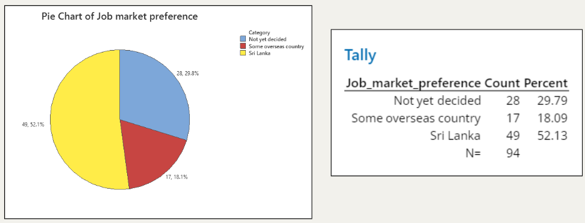
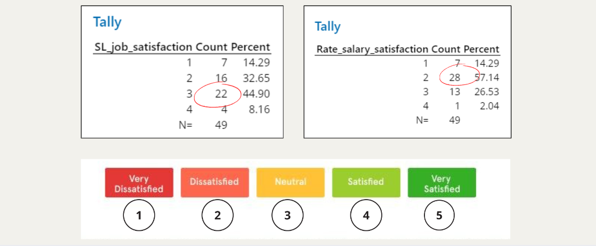
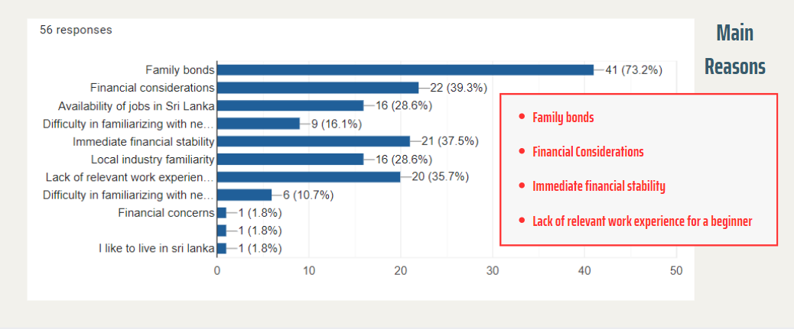
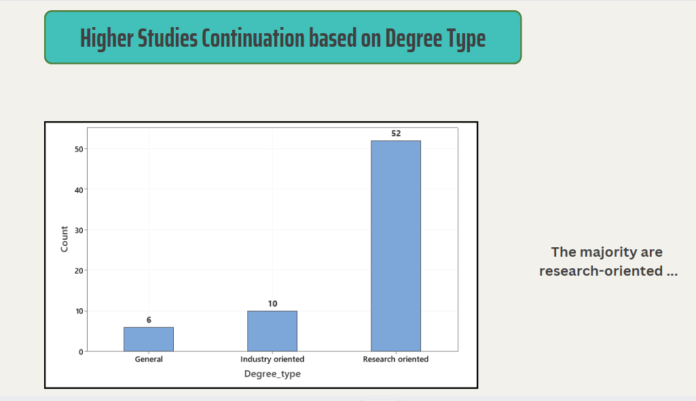
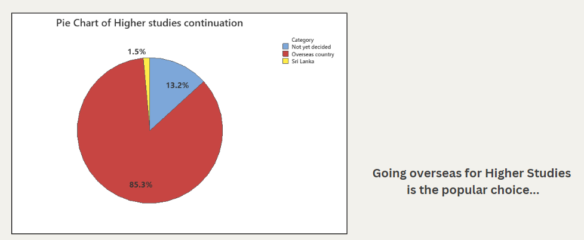
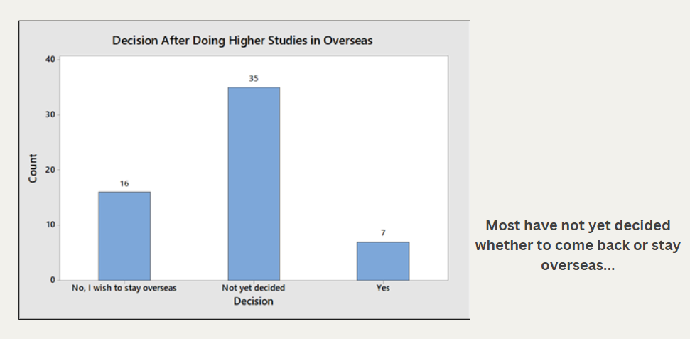
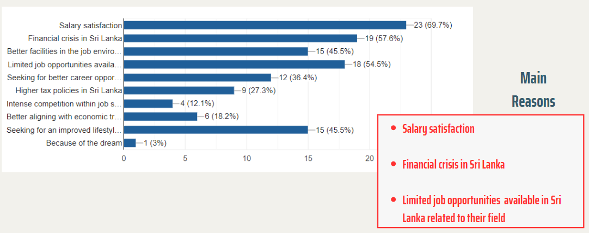
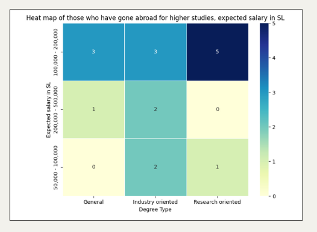

# ANALYZING THE  IMPACT OF  UNDERGRADUATE PREFERENCES  ON THE SRI LANKAN  JOB MARKET 👨🏻‍🎓🌍

## Introduction
  
Sri Lanka faces financial instability, prompting emigration and exacerbating unemployment. Understanding how undergraduates' choices impact the job market is vital. This analysis aims to identify factors influencing their decisions to enhance Sri Lanka's employment landscape.

## Significance of the study

We want to discover what motivates young Sri Lankans to move or search for opportunities abroad, that's why our study is essential. By determining these causes, we may discover the difficulties the Sri Lankan job market faces and explore possible solutions.

## Main objective 

Examining the impact on the Sri Lankan job market based on the preferences of third-year Science Undergraduates in University of Colombo

## Data Analysis
   ### Entering Sri Lankan Industry
<table>
  <tr>
    <td ></td>
    <td></td>  
  </tr>
</table>  

It appears that many people are indeed joining the Sri Lankan job market. Is this the case? According to the first pie chart, we can observe that most undergraduates are willing to enter the industry in Sri Lanka after their graduation. However, their satisfaction with the Sri Lankan job market is very low. So, what are the actual reasons for their preference?

According to the above figure, we can understand why most students are willing to join the Sri Lankan job market. A considerable number of students do not want to leave their parents and go to another country. Also, some students are facing financial instability. ****Therefore, we cannot conclude that the preference of students depends solely on the quality of the Sri Lankan job market.****

   ### Continue Higher Studies

  Now we consider those who want to pursue higher education after their graduation.
   
  <table>
  <tr>
    <td ></td>
    <td></td>  
  </tr>
</table>  
The bar graph above illustrates that a significant proportion of students can be identified as research-oriented. Moreover, a considerable majority express a preference for pursuing further education abroad.

  

Above Bar graph shows **Decision after Doing Higher studies Overseas**. According to that, majority of the undergraduates are not yet decided what they hope to do after completing their higher studies overseas. However, more students choose not to return to Sri Lanka after studying abroad than ones planning to return back. Let's understand what are the actual reasons for their preference?

The main reasons we got were salary satisfaction, the current financial crisis in Sri Lanka, and the limited job opportunities available in Sri Lanka related to their fields. Then, the students who chose an overseas job were evaluated with their degree types for the range of salaries they would expect if they were to be employed in Sri Lanka.

  

Based on the heatmap provided, it's evident that the majority of students anticipate a salary range between Rs. 100,000 and Rs. 200,000.

  ### Career Guidance Unit

  Further we analysed the familiarity of the Career Guidance Unit (CGU) among the students and usage of its services. 

  

     
  

  We saw that more than three fourths of the participants were aware of the CGU, but most of them think that the CGU has only a moderate influence on the career preferences of the undergraduates.

  

    
  
  

  When it comes to the familiarity of the local and overseas job markets, most students have a moderate idea about it. Yet a higher percentage of students are well aware of the job market when they have used the services of the CGU.

## Conclusions
  1. More than half of the sample, which is 58% prefer entering the industry after graduation, while the rest 42% prefer continuing higher studies.
  2. A higher fraction of General students and students from the departments of Statistics, Mathematics, ITU, and CGU prefer to enter the industry rather than pursue higher studies.
  3. The preference has a relationship with the GPA of the students.
  4. Many students prefer to join the Sri Lankan job market rather than overseas.
  5. Most of the students are dissatisfied with the current jobs and salaries in Sri Lanka.
  6. Research degree students expect higher salary ranges, while general degree students expect lower ranges.
  7. The financial crisis in Sri Lanka, the limitation of jobs in the relevant field, and salary satisfaction are the main causes for students to go overseas.
  8. Family bonds are the main reason why others tend to stay in Sri Lanka.
  9. From the students who prefer to go overseas for higher studies, only a few of them wish to return to Sri Lanka after completing their studies.
  10. Many students are aware of the career guidance unit, but only a few have used the services it offers.
